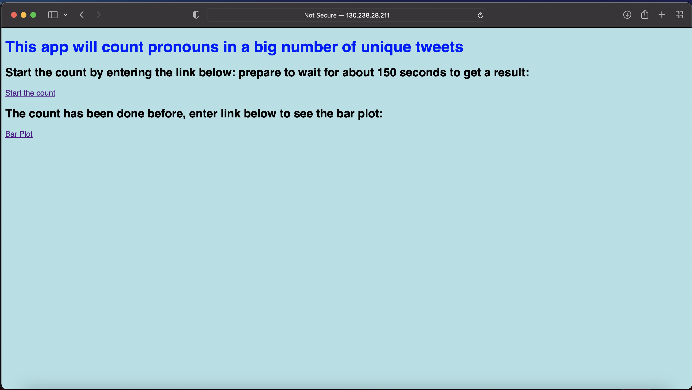
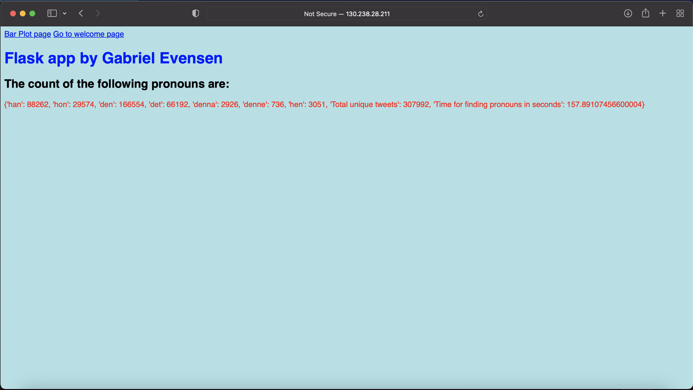
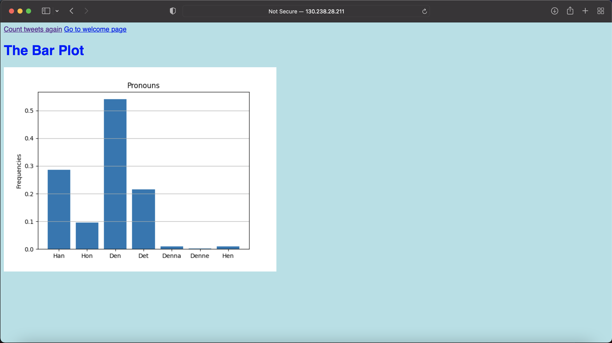

# ACC_CA3

Download the repository, add your own Openstack RC File v3 in the Deploy folder, and also the key-pair that you say you will use in the **ssc-instance-userdata.py**. The **ssc-instance-userdata.py** has to be modified, change the following rows:


keypair = _<key pair in your folder, example if key.pem enter just key>_


instancename = enter a name
  
then do the following at the ACC_CA3/Deploy folder in the terminal:

```
./deploy-vm.sh
```
enter your OpenStack Password for project UPPMAX 2021/1-5 as user xxxxxx
  
wait for 10 minutes for the insatnce to initialize
  
use the output presenting the floating ip of ypur newly created instance and enter the following in your browser:
  
```
http://<Floating IP>:5000/start_count
```
  
  
The deploy-vm.sh script will also guide you.

Log into your vm with:

```
ssh -i <keypair-name.pem> ubuntu@<Floating IP>
```
Enter ACC_CA3/Flask, then type:

```
screen
```
Followed by:
```
celery -A tasks worker --loglevel=info
```
Create a new screen 
```
ctrl+A ctrl+A
```
Then type:
```
python3 celery_app.py
```
Type the following in your browser:

```
<Floating Ip>:5000/
```
or

```
<Floating Ip>:5000/start_count
```
or

```
<Floating Ip>:5000/start_count/bar_plot
```


Three pages in the flask interface:




